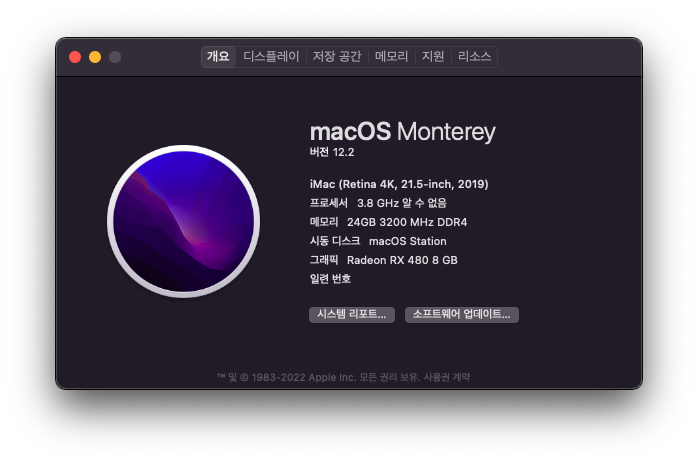

# OpenCore 0.7.7 for Ryzen 1600X, B350, RX480
## MUST BE READ
```
This bootloader's config.plist was deleted some value of Platforminfo and
set number of core to 6 for AMD Vanilla patch.

So YOU HAVE TO EDIT that value for your system.
```
Checkout follow [1. Information](#1-information)!

## 언어 / Lanugage
- [한국어](https://github.com/icaros7/OpenCore_Ryzen_B350/blob/main/Readme_ko.md)
- English (This document)



# 1. Information
The laest version of OpenCore that based on OpenCore 0.7.7. You can use this bootloader for hackintosh install & daily-use on 6-Core Ryzen & MSI B350M Mortar at 10.11 Big Sur or 12.x Monterey.

Please keep your mind follow:

1. ***STUCK OC*** -> Edit `Platforminfo` value of `config.plist`
    - via using [GenSMBIOS](https://github.com/corpnewt/GenSMBIOS)
    - FYI, [OpenCore Official Guide](https://dortania.github.io/OpenCore-Install-Guide/config-laptop.plist/skylake.html#platforminfo) for edit that values.
2. ***STUCK OC*** -> Check out your Core count, Default is `6`
    - `6` Core CPU: Ryzen 1600s, 2600s, 3500s, 3600s, 5600s
    - If not using 6 core, check out at [AMD-OSX's AMD_Vanilla](https://github.com/AMD-OSX/AMD_Vanilla)
3. ***Don't Pannic*** -> Not showing installer option
    - Press `Space bar` to showing hide options
    - In default, some unnnessary options are hided

|✅ / ❌|Feature|Etc|
|:---:|:---|:---|
|✅|External VGA|Tested on Sapphire Radeon RX480 8GB|
|✅|Hardware Acceleration||
|✅|Play DRM\*|**Need External VGA**|
|🆗|VDA Decoder\*\*|Some Ryzen (like 3200G) can use|
|❌|Microphone|Known issue cause from `AppleALC`|

1. \* Online contents service like Youtube, Netflix and etc...
2. \*\* Check out at [Apple Video Decode Acceleration Framework Reference](https://developer.apple.com/library/archive/technotes/tn2267/_index.html)

# 2. Tested Environment
|Items|Product|Etc|
|:---:|:---|:---|
|macOS|11.6.1|Big Sur|
|CPU|AMD Ryzen 1600X|Six-core processer|
|M/B|MSI B350M Mortar||
|RAM|Samsung DDR4 16 + 8GB|Sigle channel configuration|
|SSD|Sansung 850 EVO|APFS 120GB partition|
|ETC|`rEFInd`|Boot Windows + macOS via `rEFInd` configuration|

# 3. Configuration
Include following configuration

- Default Language : Korean (You can choose other language at installation step)
- Default Keyboard Layout : Qwerty
- Boot Timeout: 5 Sec.
- Set Default: Enabled (`Ctrl + Enter` to set default)
- SecurityPolicy: Disabled
- Hide Auxiliary: Enabled (`Space Bar` to see that entry like recovery)
- Boot Verbose: Disable (`Cmd + V` to boot with Verse mode)
- Apple Hot Key: Enable
- iMac (Retina 4K, 21.5-inch, 2019) Model (`iMac19,2`)
- AMD Kernel Patch for 1600x (set for Six Core)
- `FeatureUnlock` kext include (Check out [acidanthera/FeatureUnlock](https://github.com/acidanthera/FeatureUnlock))
    - Enabled `Sidecar` for 12.x

# 4. Special Thanks To
- [@acidanthera](https://github.com/acidanthera) - [OpenCorePkg](https://github.com/acidanthera/OpenCorePkg) and etc...
- [@AMD-OSX](https://github.com/AMD-OSX) - [AMD_Vanilla](https://github.com/AMD-OSX/AMD_Vanilla) patch