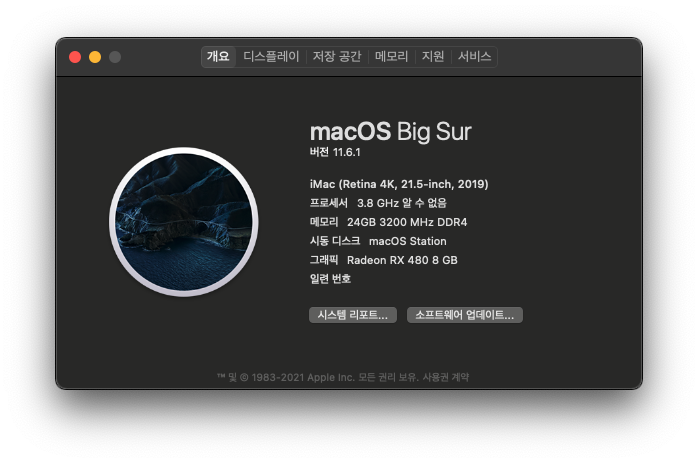

# OpenCore 0.7.5 for 라이젠 1600X, B350, RX480
## 사용 전 필독
```
본 부트로더는 config.plist 의 PlatformInfo 의 일부 정보가 모두 지워져 있으며,
AMD 바닐라 패치의 CPU 코어 수가 모두 1600X 기준으로 6개로 설정 되어 있습니다.

이로 인하여 저 두 값을 사용자의 상황에 맞게 수정 한 후 사용이 가능합니다.
```
자세한 내용은 아래 [1. 안내](#1-안내)를 참조하세요.
## Language / 언어
- 한국어 (이 문서)
- [English](https://github.com/icaros7/OpenCore_Ryzen_B350)



# 1. 안내
OpenCore 0.7.5를 기반으로 만들어진 최신 버전의 OpenCore 부트로더 입니다. 6코어 라이젠 및 MSI B350M 박격포 보드에 즉각적인 해킨토시 설치 및 실사용 가능 합니다.

아래 사항을 **꼭 숙지하시고 사용**하여 주십시오.

1. ***부팅 불가능*** -> `config.plist`의 `platforminfo` 항목들 수정 필수
    - [GenSMBIOS](https://github.com/corpnewt/GenSMBIOS)를 사용하여 수정하기
    - [오픈코어 공식 가이드](https://dortania.github.io/OpenCore-Install-Guide/config-laptop.plist/skylake.html#platforminfo) 참조하기
    - 필자 블로그 [이 글](https://minnote.net/해킨토시_hackintosh/Surface-Pro-4-Hackintosh/#6-1-모델-식별자-및-uuid-변경) 참조하기
2. ***부팅 불가능*** -> CPU 코어 개수 확인 필수, `6코어` 기본 값
    - 대표적 `6코어`: 라이젠 1600*, 2600*, 3500*, 3600*, 5600*
    - 아닌 경우 [AMD-OSX의 AMD_Vanilla](https://github.com/AMD-OSX/AMD_Vanilla)를 참조하기
3. ***당황하지 않기*** -> 설치 옵션이 안뜨는 경우
    - `스페이스 바`를 눌러 숨겨진 항목 보기
    - 리커버리, 최초 인스톨러 등 실사용 불필요 옵션은 기본 값 숨기기 설정

|✅ / ❌|기능|기타|
|:---:|:---|:---|
|✅|외장 그래픽|사파이어 라데온 RX480 8GB 확인|
|✅|하드웨어 가속||
|✅|DRM 재생\*|**외장 그래픽 필요**|
|🆗|VDA 디코더\*\*|라이젠 3200G 등 일부 라이젠의 경우 사용 가능|
|❌|마이크|이미 알려진 `AppleALC`로 인한 이슈|

1. \* Youtube, Netflix 등 온라인 컨텐츠 서비스
2. \*\* [Apple Video Decode Acceleration Framework Reference](https://developer.apple.com/library/archive/technotes/tn2267/_index.html) 참조

# 2. 테스트 환경
|항목|제품|비고|
|:---:|:---|:---|
|macOS|11.6.1|Big Sur|
|CPU|AMD 라이젠 1600X|6코어 프로세서|
|M/B|MSI B350M 박격포||
|RAM|삼성 DDR4 16 + 8GB|싱글 채널 구성|
|SSD|삼성 850 EVO|APFS 120GB 파티션|
|ETC|`rEFInd`|`rEFInd`를 통한 Windows + macOS 환경 구성|

# 3. 설정
다음과 같은 설정을 포함하고 있습니다.

- 기본 언어: 한국어 (설치 과정 중 변경 가능)
- 기본 키보드 배열: 쿼티 (설치 과정 중에만 해당)
- 자동 부팅: 5초
- 자동 부팅 선택: 가능 (`Ctrl + 엔터`를 누를 경우 기본 값 설정)
- 보안 정책: 비활성화
- 기타 부트 옵션: 숨김 (`스페이스바`를 누를 경우 리커버리같은 해당 옵션 보기 가능)
- 부팅 Verbose: 비활성화 (`Cmd + V`를 누를 경우 Verse 모드로 부팅)
- 애플 단축키: 활성화
- iMac (레티나 4K, 21.5-inch, 2019년) 모델 (`iMac19,2`)
- 1600x용 AMD 커널 패치 (6코어용)

# 4. Special Thanks To
- [@acidanthera](https://github.com/acidanthera) - [OpenCorePkg](https://github.com/acidanthera/OpenCorePkg) 및 기타 등등
- [@AMD-OSX](https://github.com/AMD-OSX) - [AMD_Vanilla](https://github.com/AMD-OSX/AMD_Vanilla) patch